# 💎SAP GUI FOR WINDOWSをコマンドラインから起動してみる

**この記事は [SAP Advent Calendar 2019](https://adventar.org/calendars/3908) の12月5日分の記事として執筆しています**

- [SAP Advent Calendar 2019](https://adventar.org/calendars/3908)

本記事ではタイトルにある通り、SAP GUI FOR WINDOWSをコマンドラインから起動してみます。
普段、saplogonからGUIを起動するかと思いますが、コマンドラインから起動する際の小ネタとなります。

## 💎そもそもSAP GUI FOR WINDOWSって？

SAP GUI FOR WINDOWSはSAPシステムに接続するためのGUIクライアントソフトウェアのWINDOWS版。  

SAPシステムに接続する方法の1つとして、SAPログオンパッドに接続先情報を追加してGUIを起動する方法があるかと思いますが。
今回はコマンドラインから接続先情報を指定してSAPGUIを起動する方法を説明する。

なおSAPGUIをコマンドラインから起動するには、インストールしているSAPGUIのバージョンによって利用するexeが変わります。

[103019 - SAPShortcut: Program parameters](https://launchpad.support.sap.com/#/notes/103019)より

| SAPGui Version | exe          |
| -------------- | ------------ |
| For GUI < 45B  | sapsh.exe    |
| For GUI >= 45B | sapshcut.exe |
| For GUI >= 620 | SAPgui.exe   |

本資料では45B以上を対象として、sapshcut.exeとSAPgui.exeをCMDとPowerShellから利用する方法について説明する。

## 💎関連ドキュメント

- [SAP Community wiki - SAPGUI shortcuts](https://wiki.scn.sap.com/wiki/display/ABAP/SAPGUI+shortcuts)
- [103019 - SAPShortcut: Program parameters](https://launchpad.support.sap.com/#/notes/103019)
- [390832 - Additional parameters for SAP GUI call](https://launchpad.support.sap.com/#/notes/390832)
- [1073779 - setting the Frontend Up-/Download Codepage](https://launchpad.support.sap.com/#/notes/1073779)
- [519852 - Working directory of SAP GUI for Windows](https://launchpad.support.sap.com/#/notes/519852))

## 💎起動に利用するexeのインストール場所

SAPGUIをセットアップしたディレクトリの配下に`FrontEnd\SapGui`があるのでそこにインストールされています。

本資料の環境では下記のような配置となっている。

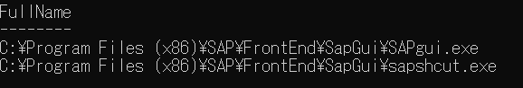

## 💎sapshcut.exeを利用してSAPGuiを起動

### 💎sapshcutのhelpを参照してみる

sapshcut.exeに引数`/?`,`/help`で実行するとポップアップでhelpが表示されるので確認してみます。

▶sapshcutのhelp  
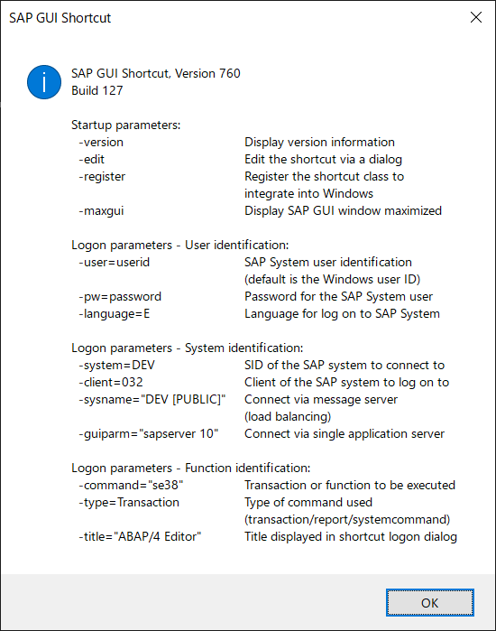

[103019 - SAPShortcut: Program parameters](https://launchpad.support.sap.com/#/notes/103019)に詳しい説明があるのでNoteを参照すればOK。

まとめると下記のようになります。

| args      | alias | description                                                                                                                                                 |
| --------- | ----- | ----------------------------------------------------------------------------------------------------------------------------------------------------------- |
| -version  |       | バージョン情報                                                                                                                                              |
| -help     | -?    | ヘルプ表示                                                                                                                                                  |
| -register |       | windowsのレジストリに登録する。.sapファイルの関連付け、.sapファイルの右クリックから編集とログイン、右クリックから.sapファイルの新規作成が出来るようになる。 |
| -edit     |       | .sapファイルを設定して書き出す。                                                                                                                            |
| -system   | -sid  | システムID                                                                                                                                                  |
| -client   | -clt  | クライアント番号                                                                                                                                            |
| -user     | -u    | ユーザ名                                                                                                                                                    |
| -pw       |       | パスワード                                                                                                                                                  |
| -language | -l    | ログイン言語                                                                                                                                                |
| -type     | -t    | コマンドのタイプを指定（transactioncode/report/systemcommand）                                                                                              |
| -command  | -cmd  | コマンド（transactioncode/report/systemcommand）                                                                                                            |
| -guiparm  | -gui  | パラメータを使用した対象システムの指定                                                                                                                      |
| -title    | -tlt  | 開始される機能の表題を指定                                                                                                                                  |
| -trace    | -trc  | SAP GUI Traceレベルの設定                                                                                                                                   |
| -workdir= | -wd   | 現在廃止されたオプション                                                                                                                                    |
| -maxgui   | -max  | GUI起動時に最大化するかどうか。レジストリ:`HKEY_CURRENT_USER\Software\SAP\SAPGUI Front\SAP Frontend Server\Window\Maxmize`に値がセットされる                |
| -reuse    |       | In SAP GUI 620 patch >= 13 GUI接続時に既存の接続を再利用するかどうか設定                                                                                    |
| -snc_name |       | SNC(SecureNetworkcommunication)。SNC名の設定                                                                                                                |
| -snc_qop  |       | SNC  Quality of Protection。必要な保護品質レベルの設定                                                                                                      |

### 💎最低限指定する必要があるパラメータ

SAPGUIを起動するのに最低限必要なパラメータは下記。

- system
- client
- guiparam

パラメータuserとpasswordを引数に含めない場合は実行時に別途入力ポップアップが表示されます。

▶ログイン情報（userとpassword）を引数に含めない場合は下記のような入力ポップアップが立ち上がります。  
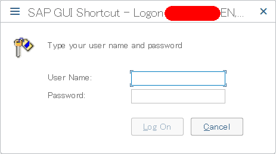

### 💎guiparamについて補足

guiparmについては接続先情報を記載するわけですが

saprouterを利用しない場合は

```param
/H/SapHost/S/SapHostServicePortNo
```

SAPRouter経由で接続する場合は

```param
/H/SapRouter/S/SapRouterServicePortNo/H/SapHost/S/SapHostServicePortNo
```

のように記載すれば接続できます。

### 💎Transcrion:SU01を起動（sapshcut）

```param
.\sapshcut.exe -system="SystemID" -client="ClientNo" -user="UserName" -pw="Password" -language="EN"　-type="Transaction" -command="su01" -guiparam="/H/SapRouter/S/SapRouterServicePortNo/H/SapHost/S/SapHostServicePortNo"
```

#### 💎CMDから起動（sapshcut）

▶CMDから実行  
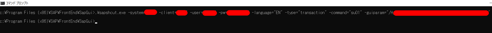

▶接続確認のポップアップが表示されるので確認して許可  
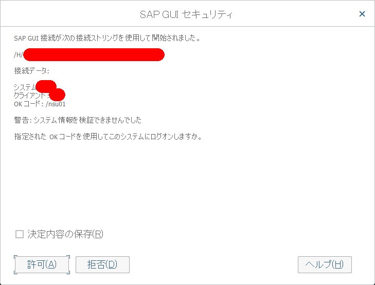

▶コマンドを実行するとSU01の画面が直接起動  
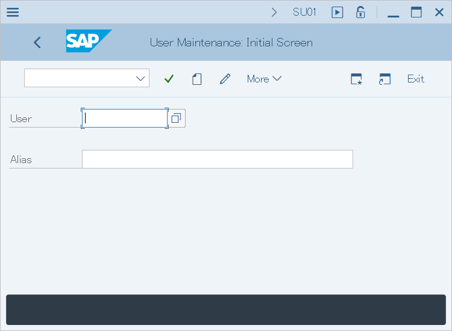

#### 💎PowerShellから起動（sapshcut）

▶PowerShellから実行  


▶接続確認のポップアップが表示されるので確認して許可  


▶コマンドを実行するとSU01の画面が直接起動  


## 💎SAPgui.exeを利用してGuiを起動

SAPgui.exeからSAPGUIを起動する場合には、`SAPgui.exe /SHORTCUT="..."`の`...`部分にsapshcutで使用した引数を記述すれば動きます。  
※注意点。SHORTCUTにリテラルで引数を引き渡せば良いのですがリテラルの前後をダブルコーテーションで括る事が必須となります。  

### 💎Transcrion:SU01を起動（SAPgui）

#### 💎CMDから起動（SAPgui）

CMDから起動する場合は下記のように記述すれば動きます。

```CMD
.\SAPgui.exe /SHORTCUT="-system="SystemID" -client="ClientNo" -user="UserName" -pw="Password" -language="EN" -type="Transaction" -command=su01 -guiparam="/H/SapRouter/S/SapRouterServicePortNo/H/SapHost/S/SapHostServicePortNo" "
```

▶CMDから起動  
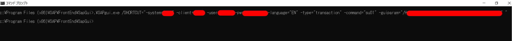

▶接続確認のポップアップが表示されるので確認して許可する  


▶コマンドを実行するとSU01の画面が直接起動する  


#### 💎PowerShellから起動（SAPgui）

冒頭で記載しましたが、SHORTCUTに引き渡すパラメータはリテラルの前後をダブルコーテーションで括る事が必須となります。

PowerShellではCMDと違い、ダブルコーテーションがあると別途エスケープ処理をしておかないとダブルコーテーションを解釈してしまい引き渡されません。

PowerShellでのダブルコーテーションのエスケープ処理方法としては

- PowerShellのエスケープ文字`（グレイヴ・アクセント）でエスケープ処理する
- シングルコーテーションで文字列として引き渡す

という二種類の手法がありますが、`（グレイヴ・アクセント）でエスケープするのはかなりめんどくさいので今回はシングルコーテーションでエスケープする例のみ実施します。

```PowerShell
# シングルコーテーションでダブルコーテーションを処理する
.\SAPgui.exe /SHORTCUT='"-system=SystemID -client=ClientNo -user=UserName -pw=Password -language=EN -type=Transaction -command=su01 -guiparam=/H/SapRouter/S/SapRouterServicePortNo/H/SapHost/S/SapHostServicePortNo" "'
```

▶シングルコーテーションでダブルコーテーションをエスケープする例  
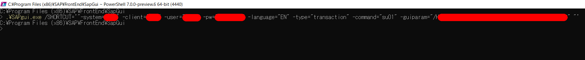

#### 💎PowerShellのエスケープ処理について補足

SAPgui.exeでSHORTCUT引数の情報をリテラルで渡す際に、リテラルの前後にダブルコーテーションが必須という所は注意が必要。

[103019 - SAPShortcut: Program parameters](https://launchpad.support.sap.com/#/notes/103019)に下記のように記載されている事に気が付かず最初ハマりました。

> The quotation marks (") in the command SAPgui.exe /SHORTCUT="..." are required.

コマンドプロンプトだと下記のようにダブルコーテーションで括って渡すとダブルコーテーションも含まれるが。
PowerShellだとダブルコーテーションで括ると変数を解釈して文字列に展開するためダブルコーテーションは含まれない。

▶コマンドプロンプトだとダブルコーテーションごと引き渡される  
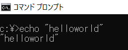

▶PowerShellだとダブルコーテーション自体は引き渡されない  
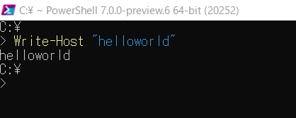

## レポート:DEMO_GAME_2048_740を起動してみる

ここではtype reportのパラメータを試してみる。

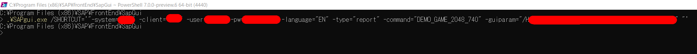

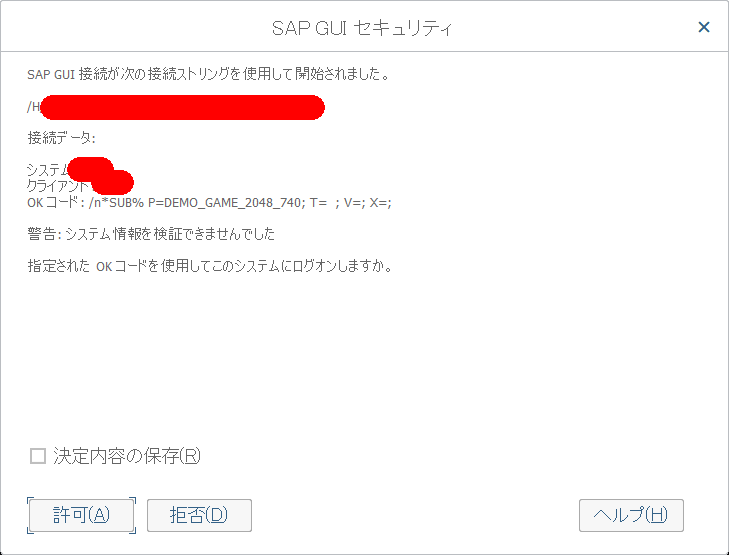

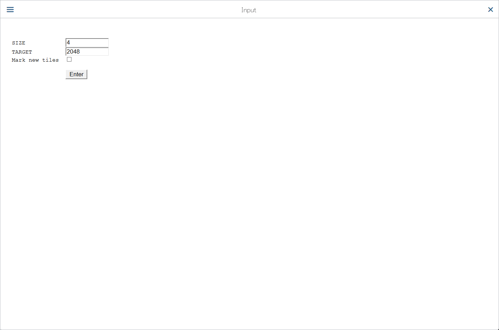

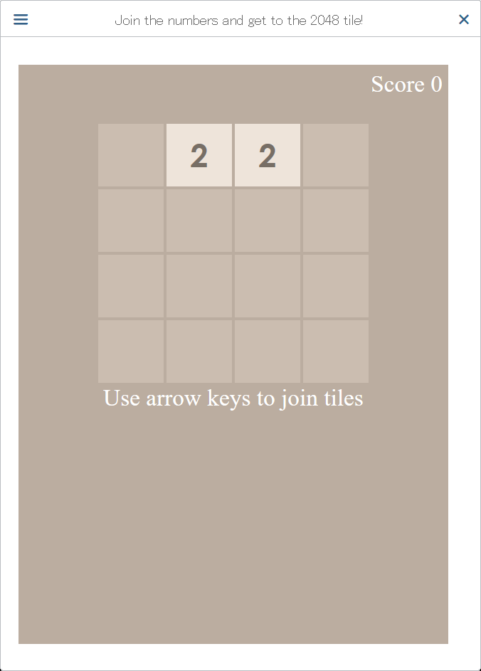

## 💎総評

普段、ログオンパッドから接続先情報を選んでGUIを起動するのが大半な気がしますが。

最近はRPAとかでSAPGUIを操作しようとした際には

1.ログオンパッドを起動
2.ログオン先を選択
3.GUIが立ち上がるのでログイン
4.トランザクションコードを入力

とかやるのではなく処理したい画面を指定して起動するというのはそこそこ需要があるのか？
